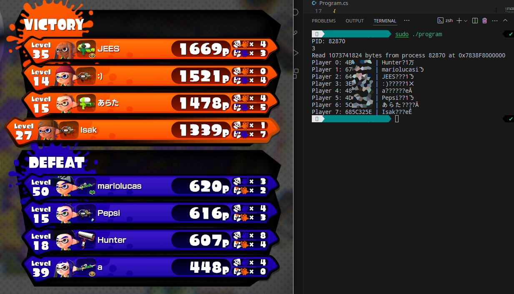

# LinuxGrabber
A CLI PID grabber for Splatoon v288 for Cemu running on Linux.

# Output
The output contains the PID in hex and decimal representations, plus the player's name.



## Compile
You'll need the mono package to compile the program. I developed this application on Arch linux, so I installed mono using:

```bash
sudo pacman -S mono
```

For debian based distros:

```bash
sudo apt install mono-mcs
```

To compile the program simply run:
```bash
mcs -out:LinuxGrabber LinuxGrabber.cs
```

And you have the executable.

## Running the program
As this application needs to access another's process memory, it needs to be run as root or as a user that has permission to do so:

```bash
sudo ./LinuxGrabber
```
